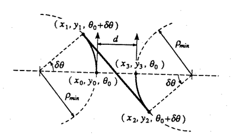
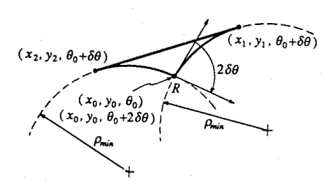
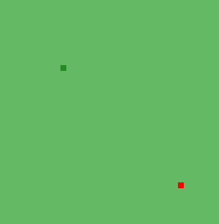

# Path Planning for Reeds-Shepp Car

## Table of Contents
 - [Introduction](#introduction)
 - [Model Description](#model-description)
 - [Limitations](#limitations)
 - [Collision Detection](#collision-detection)
 - [Path Planning Techniques](#path-planning-techniques)
    - [RRT](#rrt)
    - [RRT\*](#rrt-star)
    - [Type 1 and Type 2 maneuvers](#maneuvers)
    - [Collision Detection](#collision-detection)
 - [Results](#results)
    - [Holonomic Robot](#non-holonomic-demo)
    - [Non-Holonomic Robot](#holonomic-demo)
 - [Evaluation](#evaluation)
 - [Installation](#installation)
 - [Execution Instruction](#execution-instruction)
 - [Source Code](#source-code)
 - [References](#references)
 
## Introduction
The goal of this project is to implement sampling based motion planning 
algorithms such as Rapidly-Exploring Random Tree(RRT) and its variant RRT* for a 
holonomic point robot and a Reeds-Shepp car like robot with 
non-holonomic constraints.

When I was implementing RRT* with non-holonomic constraints, I
noticed that we need to be able to reach a nearby point(q_near) with its 
orientation from the new configuration(q_new). This is mostly impossible to reach
by just trying the six combination of inputs that a Reeds-Shepp Car can
take. So I also implemented ***Type 1*** and ***Type 2*** maneuvers for a car like 
robot to reach a desired configuration by doing combinations of these two
maneuvers.
 
 
## Model Description
 - Robot Model &nbsp;&nbsp;&nbsp;&nbsp;&nbsp;&nbsp;&nbsp;&nbsp;&nbsp;:   Point Robot and Reeds-Shepp Car(Rigid Body)
 - Type        &nbsp;&nbsp;&nbsp;&nbsp;&nbsp;&nbsp;&nbsp;&nbsp;&nbsp;&nbsp;&nbsp;&nbsp;&nbsp;&nbsp;&nbsp;&nbsp;&nbsp;&nbsp;&nbsp;&nbsp;&nbsp;:   Holonomic and Non-Holonomic
 - Workspace   &nbsp;&nbsp;&nbsp;&nbsp;&nbsp;&nbsp;&nbsp;&nbsp;&nbsp;&nbsp;&nbsp;:   2-D plane with Obstacles
 - Collision Detection: Axis Aligned Bounding Boxes(Implemented)

## Limitations
For the non-holonomic case, I'm still defining the robot as point
because of my collision detection methods can only tell whether a point
lies inside the obstacle or not. I didn't implement polygon-polygon 
collision detection methods to facilitate this and also using
existing libraries for collision detection even complicates my data structures.
 
## Collision Detection
### Axis Aligned Bounding Box
The collision detection method that I implemented and used to check
 collision for the below path planning techniques is Axis aligned 
 bounding boxes. Here every obstacle in the environment is bounded by a 
 rectangle of smallest possible size and checking the robot is inside the
 rectangle while planning the path.
 
## Path Planning Techniques
 - RRT
 - RRT*
 - Type 1 and Type 2 Maneuvers
### Type 1 and Type 2 Maneuvers
Type 1: This maneuver is to take the robot from a configuration to another
configuration without changing the orientation(Like parallel parking). 

Type 2: This maneuver is to bring a robot from some orientation to a
desired orientation in-place(Like a three-point turn)

There was a third type of movement is implemented to connect these two
maneuvers to reach the goal exactly. First, type 2 maneuver is done to 
change to desired orientation and then marching forward or backward till it 
finds a point that is exactly parallel to the goal configuration, then 
type 1 maneuver is done to reach the goal configuration. Below GIF shows
type 1, type 2 and marching in cyan, brown and yellow colors respectively
from the simulation.

## Results

### Holonomic Robot

### Non-Holonomic Robot
